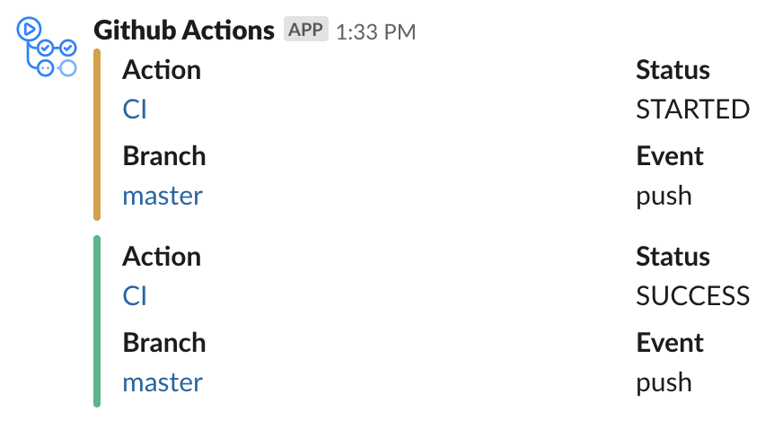
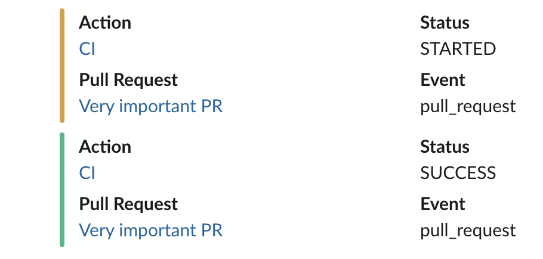
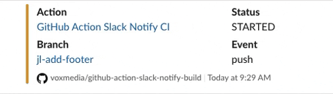

# :warning: Slack Notify Build was [DEPRECATED] May 2024 :warning:

# Slack Notify Build

This action prints your GitHub Action build status to Slack. It takes an opinionated approach by showing attachments for metadata like branch, pull request, and event. This action allows [existing messages to be updated](#updating-an-existing-message) to reduce unwanted noise in your Slack channel. Heavily-inspired by [Post Slack messages](https://github.com/marketplace/actions/post-slack-message).

A [Slack bot token](https://api.slack.com/docs/token-types) is required to use this action, and the associated app must be granted permission to post in the channel, private group or DM you specify.

## Usage

```yaml
uses: voxmedia/github-action-slack-notify-build@v1
with:
  channel: app-alerts
  status: STARTED
  color: good
env:
  SLACK_BOT_TOKEN: ${{ secrets.SLACK_NOTIFICATIONS_BOT_TOKEN }}
```

The Slack notification leverages attachments to group important information together and provide valuable links:



When used with the `pull_request` event, a link to the originating pull request is included:



### Updating an Existing Message

If you need to send multiple Slack build updates and you prefer to update a single message instead of posting multiple messages, you can pass a `message_id` to future steps.



Note: You must assign a step `id` to the first Slack notification step in order to reference it for future steps:

```yaml
- name: Notify slack success
  if: success()
  id: slack # IMPORTANT: reference this step ID value in future Slack steps
  env:
    SLACK_BOT_TOKEN: ${{ secrets.SLACK_NOTIFICATIONS_BOT_TOKEN }}
  uses: voxmedia/github-action-slack-notify-build@v1
  with:
    channel: app-alerts
    status: STARTING
    color: warning

- name: Run tests
  # ... your test step here
- name: Notify slack success
  if: success()
  env:
    SLACK_BOT_TOKEN: ${{ secrets.SLACK_NOTIFICATIONS_BOT_TOKEN }}
  uses: voxmedia/github-action-slack-notify-build@v1
  with:
    # Updates existing message from the first step
    message_id: ${{ steps.slack.outputs.message_id }}
    channel: app-alerts
    status: SUCCESS
    color: good
```

### Reporting Success or Failure

You can use the `success()` and `failure()` conditional checks within your workflow to determine which build notification to send:

```yaml
- name: Run tests
  # ... your test step here
- name: Notify slack success
  if: success()
  env:
    SLACK_BOT_TOKEN: ${{ secrets.SLACK_NOTIFICATIONS_BOT_TOKEN }}
  uses: voxmedia/github-action-slack-notify-build@v1
  with:
    channel: app-alerts
    status: SUCCESS
    color: good

- name: Notify slack fail
  if: failure()
  env:
    SLACK_BOT_TOKEN: ${{ secrets.SLACK_NOTIFICATIONS_BOT_TOKEN }}
  uses: voxmedia/github-action-slack-notify-build@v1
  with:
    channel: app-alerts
    status: FAILED
    color: danger
```

## Inputs

### `status`

**Required** The status to show for the action, e.g. `STARTED` or `FAILED`.

### `channel`

The name of the channel to post the message to. **Required** if no `channel_id` is provided.

_Note_: If your workspace has many channels, supplying only a `channel` may cause rate limiting issues with this GitHub Action. Consider supplying a `channel_id` instead.

### `channel_id`

The ID of the channel to post the message to. **Required** if no `channel` is provided, or if you need to send to a DM.

### `color`

The color to use for the notification. Can be a hex value or any [valid Slack color level](https://api.slack.com/reference/messaging/attachments#fields) (e.g. `good`). Defaults to `#cccccc`.

### `message_id`

The ID of a previous Slack message to update instead of posting a new message. Typically passed using the `steps` context:

```yaml
message_id: ${{ steps.<your_first_slack_step_id>.outputs.message_id }}
```

## Outputs

### `message_id`

Returns the unique message ID, which is a timestamp which can be passed to future Slack API calls as `ts`.

## Setup

To use this GitHub Action, you'll need a [Slack bot token](https://api.slack.com/docs/token-types). A bot token must be associated with a Slack app.

### Creating a Slack App

1. **Create a Slack App.** Go to Slack's developer site then click "Create an app". Name the app "GitHub Action" (you can change this later) and make sure your team's Slack workspace is selected under "Development Slack Workspace".
1. **Add a Bot user.** Browse to the "Bot users" page listed in the sidebar. Name your bot "GitHub Action" (you can change this later) and leave the other default settings as-is.
1. **Set an icon for your bot.** Browse to the "Basic information" page listed in the sidebar. Scroll down to the section titled "Display information" to set an icon.
1. **Install your app to your workspace.** At the top of the "Basic information" page, you can find a section titled "Install your app to your workspace". Click on it, then use the button to complete the installation.

### Slack App OAuth Scopes

In order to use your Slack App with this GitHub Action, be sure to enable the following OAuth scopes:

| Scope           | Required?                                  |
| --------------- | ------------------------------------------ |
| `chat:write`    | Yes                                        |
| `channels:read` | If using `channel` instead of `channel_id` |
| `groups:read`   | If using `channel` instead of `channel_id` |

## License

The scripts and documentation in this project are released under the [Apache 2.0 License](LICENSE).
